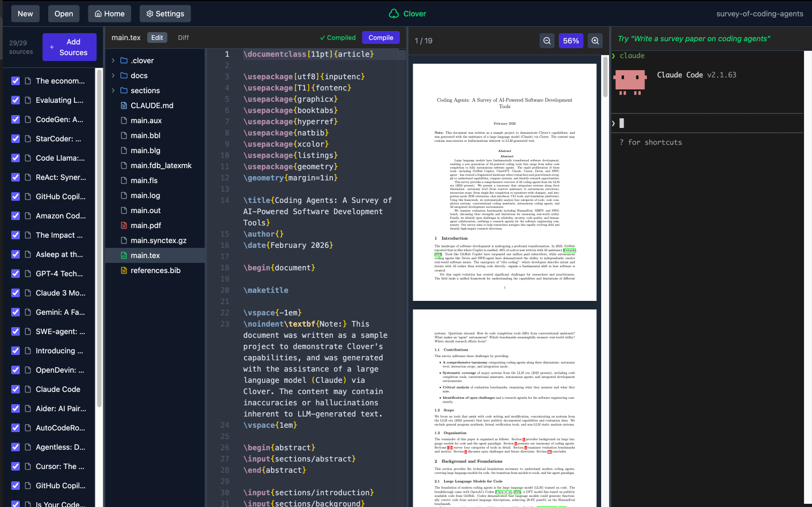

# ♧ Clover

A LaTeX editor with Claude Code integration and NotebookLM-style source management, designed for writing papers from local data.



## Features

- From data to paper: add experiment results as sources, analyze data, generate figures, and write
- NotebookLM-style Source management: manage PDFs, experiment data, and notes as references
- Claude Code integration — reads your local files and writes LaTeX directly
- Deep research: find and collect papers automatically
- Claude Code skills designed for paper writing
- Git diff view: see what the agent changed at a glance
- Desktop app (Electron) and web app (for remote servers)

## Quick Start

### Requirements

- [Node.js](https://nodejs.org/en/download) 18+
- Your TeX environment ([TeX Live](https://www.tug.org/texlive/), MacTeX, MiKTeX, etc.)
- [Claude Code](https://claude.com/product/claude-code)

### Setup

1. Install [Claude Code](https://claude.com/product/claude-code)
2. Clone this repository and open it with Claude Code:
```bash
git clone https://github.com/yoichi1484/clover.git
cd clover
claude
```
3. Tell Claude Code:
   > "Set up the TeX environment and launch Clover."

Claude will install Node.js, TeX, and any other dependencies, then start the app.

### Desktop App (Electron)

```bash
npm install
npm run dev
```

### Web App

```bash
npm install
npm run build:web
npm run start:server  # Starts on port 8080 (auto-opens browser)

# Options:
npm run start:server -- --port 3000    # Use specific port
npm run start:server -- --no-open      # Don't open browser
```

If port 8080 is in use, it automatically tries 8081, 8082, etc.

## Usage

### Create a Project

1. Click "New Project"
2. Select a directory
3. Start writing LaTeX

### Add Sources (optional)

- Add local files (PDFs, CSVs, notes) via the Sources panel — their paths become visible to Claude Code
- Or tell Claude Code to find references:
  > "Research the latest papers on coding agents and add them as sources"

### Writing with Claude Code

1. Press Enter in the terminal panel to start Claude Code
2. Tell Claude what you want to write, for example:
   > "Write a technical book about coding agents."
3. Claude will ask clarifying questions (topic, audience, structure, etc.) and write the document — just answer and let it work

### Example Projects

Sample projects are in `sample-project/`. Each was created from an empty folder with a single instruction:

- `clover-overview` — *"I want to write a book explaining Clover."* — complete in about an hour.
- `survey-of-coding-agents` — *"Write a survey paper on coding agents."*

### Keyboard Shortcuts

- `Cmd/Ctrl+S` - Save
- `Cmd/Ctrl+B` - Compile to PDF
