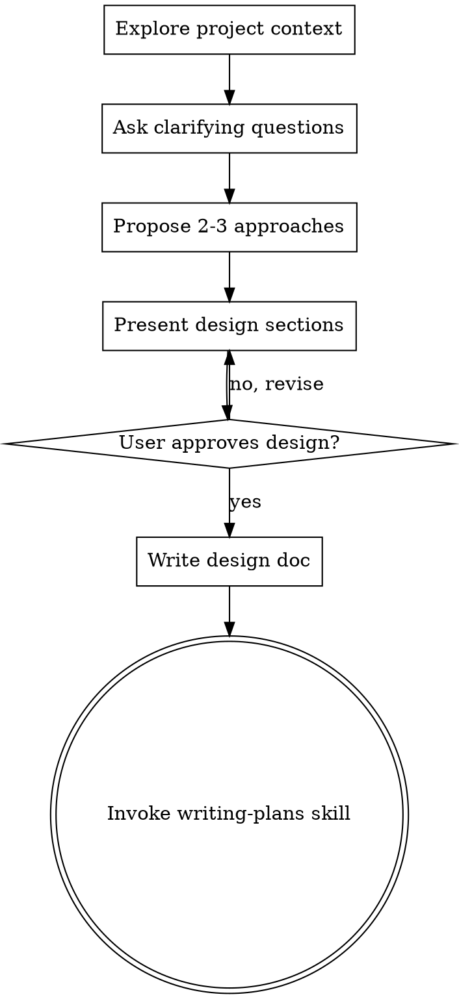

# Brainstorming Ideas Into Designs

## Overview

Help turn ideas into fully formed designs and specs through natural collaborative dialogue.

Start by understanding the current project context, then ask questions one at a time to refine the idea. Once you understand what you're building, present the design and get user approval.

<HARD-GATE>
Do NOT invoke any implementation skill, write any code, scaffold any project, or take any implementation action until you have presented a design and the user has approved it. This applies to EVERY project regardless of perceived simplicity.
</HARD-GATE>

## Anti-Pattern: "This Is Too Simple To Need A Design"

Every project goes through this process. A todo list, a single-function utility, a config change — all of them. "Simple" projects are where unexamined assumptions cause the most wasted work. The design can be short (a few sentences for truly simple projects), but you MUST present it and get approval.

## Checklist

You MUST create a task for each of these items and complete them in order:

0. **Clarify document type (if unclear)** — Academic paper / Technical doc / Manual / Report
1. **Explore project context** — check files, docs, sources.json
2. **Ask clarifying questions** — one at a time, understand purpose/constraints/success criteria
3. **Ask source collection method** — how to gather sources for each section (see below)
4. **Propose 2-3 approaches** — with trade-offs and your recommendation
5. **Present design** — in sections scaled to their complexity, get user approval after each section
6. **Git version control setup** — ask user if they want git tracking for this session
7. **Write design doc** — save to `docs/plans/YYYY-MM-DD-<topic>-design.md` and commit (include source collection decisions)
8. **Transition to implementation** — invoke writing-plans skill to create implementation plan

## Process Flow



**The terminal state is invoking writing-plans.** The ONLY skill you invoke after brainstorming is writing-plans.

## Step 0: Clarify Document Type (if unclear)

**If the user's intent is not clear from their request**, ask what type of document they want:

Ask: "What type of document would you like to create?"
- Academic paper (論文) - formal structure, citations, abstract
- Technical documentation (技術文書) - explanations, examples, references
- Manual/Guide (マニュアル) - step-by-step instructions
- Memo/Note (メモ) - informal, quick notes
- Report (レポート) - structured findings/analysis

**Skip this step if:**
- User explicitly stated the document type (e.g., "write a paper about...", "create a manual for...")
- Context makes the document type obvious

The document type affects:
- Structure and sections
- Formality of language
- Whether citations/references are needed
- Level of detail

## The Process

**Understanding the idea:**
- Check out the current project state first (files, docs, recent commits)
- Ask questions one at a time to refine the idea
- Prefer multiple choice questions when possible, but open-ended is fine too
- Only one question per message - if a topic needs more exploration, break it into multiple questions
- Focus on understanding: purpose, constraints, success criteria

**Exploring approaches:**
- Propose 2-3 different approaches with trade-offs
- Present options conversationally with your recommendation and reasoning
- Lead with your recommended option and explain why

**Presenting the design:**
- Once you believe you understand what you're building, present the design
- Scale each section to its complexity: a few sentences if straightforward, up to 200-300 words if nuanced
- Ask after each section whether it looks right so far
- Cover: structure, sections, content flow, citations, verification
- Be ready to go back and clarify if something doesn't make sense

## Source Collection Method

**Before finalizing the design, ask the user how sources should be gathered for writing.**

Ask: "How should sources be collected for each section?"
- **Agent researches and adds** - I'll search for relevant papers/references and add them to sources.json using add-to-sources skill
- **User adds manually** - You'll add sources via Clover UI (click the Add button in Sources panel)
- **Both** - I'll research and add, and you can add additional sources too

**This decision is recorded in the design doc** and used by execution skills (subagent-driven-development, dispatching-parallel-agents) to ensure:
1. Sources are collected BEFORE writing each section
2. Writing is based on actual sources, not hallucinated content

**If user chooses "User adds manually" or "Both":**
- Remind user: "Please add your sources using the Add button in Clover's Sources panel before I start writing each section"
- Execution skills will prompt user to confirm sources are ready before proceeding

## Git Version Control Setup

**Before starting implementation, ask the user about git version control.**

Ask: "Would you like to use git for version control during this writing session?"
- **Yes, use git** - Commit changes after each major edit
- **No, skip git** - Proceed without version control
- **Already set up** - User has already configured git

**If user chooses "Yes, use git":**

1. Create initial commit if not already done:
```bash
git add -A
git commit -m "Before AI writing session - $(date +%Y-%m-%d_%H:%M)"
```

2. Create/update CLAUDE.md to persist git instructions:
```markdown
# Project Instructions

## Version Control
This project uses git for version control. After making any changes to files:
1. Stage all changes: `git add -A`
2. Commit with descriptive message: `git commit -m "Description of changes"`

Always commit after completing a writing task.
```

## After the Design

**Documentation:**
- Write the validated design to `docs/plans/YYYY-MM-DD-<topic>-design.md`
- Commit the design document to git (if git is enabled)

**Implementation:**
- Invoke the writing-plans skill to create a detailed implementation plan
- Do NOT invoke any other skill. writing-plans is the next step.

## Key Principles

- **One question at a time** - Don't overwhelm with multiple questions
- **Multiple choice preferred** - Easier to answer than open-ended when possible
- **YAGNI ruthlessly** - Remove unnecessary features from all designs
- **Explore alternatives** - Always propose 2-3 approaches before settling
- **Incremental validation** - Present design, get approval before moving on
- **Be flexible** - Go back and clarify when something doesn't make sense
