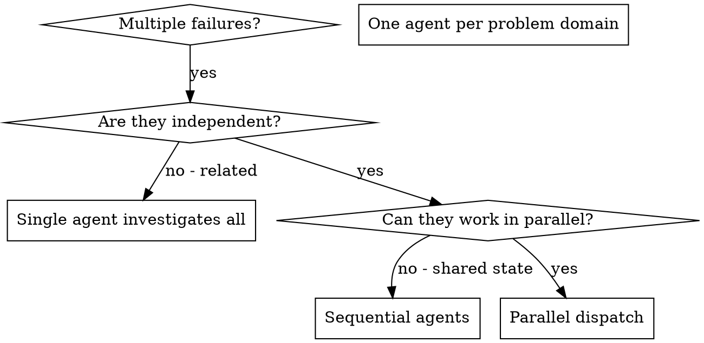

# Dispatching Parallel Agents

## Overview

When you have multiple unrelated failures (different test files, different subsystems, different bugs), investigating them sequentially wastes time. Each investigation is independent and can happen in parallel.

**Core principle:** Dispatch one agent per independent problem domain. Let them work concurrently.

**Source-first writing:** Before writing any section, sources MUST be collected and read. Never write without sources.

## When to Use



**Use when:**
- 3+ test files failing with different root causes
- Multiple subsystems broken independently
- Each problem can be understood without context from others
- No shared state between investigations

**Don't use when:**
- Failures are related (fix one might fix others)
- Need to understand full system state
- Agents would interfere with each other

## The Pattern

### 1. Identify Independent Domains

Group failures by what's broken:
- File A tests: Tool approval flow
- File B tests: Batch completion behavior
- File C tests: Abort functionality

Each domain is independent - fixing tool approval doesn't affect abort tests.

### 2. Create Focused Agent Tasks

Each agent gets:
- **Specific scope:** One test file or subsystem
- **Clear goal:** Make these tests pass
- **Constraints:** Don't change other code
- **Expected output:** Summary of what you found and fixed

### 3. Dispatch in Parallel

```typescript
// In Claude Code / AI environment
Task("Fix agent-tool-abort.test.ts failures")
Task("Fix batch-completion-behavior.test.ts failures")
Task("Fix tool-approval-race-conditions.test.ts failures")
// All three run concurrently
```

### 4. Review and Integrate

When agents return:
- Read each summary
- Verify fixes don't conflict
- Run full test suite
- Integrate all changes

## Agent Prompt Structure

Good agent prompts are:
1. **Focused** - One clear problem domain
2. **Self-contained** - All context needed to understand the problem
3. **Specific about output** - What should the agent return?

```markdown
Fix the 3 failing tests in src/agents/agent-tool-abort.test.ts:

1. "should abort tool with partial output capture" - expects 'interrupted at' in message
2. "should handle mixed completed and aborted tools" - fast tool aborted instead of completed
3. "should properly track pendingToolCount" - expects 3 results but gets 0

These are timing/race condition issues. Your task:

1. Read the test file and understand what each test verifies
2. Identify root cause - timing issues or actual bugs?
3. Fix by:
   - Replacing arbitrary timeouts with event-based waiting
   - Fixing bugs in abort implementation if found
   - Adjusting test expectations if testing changed behavior

Do NOT just increase timeouts - find the real issue.

Return: Summary of what you found and what you fixed.
```

## Common Mistakes

**❌ Too broad:** "Fix all the tests" - agent gets lost
**✅ Specific:** "Fix agent-tool-abort.test.ts" - focused scope

**❌ No context:** "Fix the race condition" - agent doesn't know where
**✅ Context:** Paste the error messages and test names

**❌ No constraints:** Agent might refactor everything
**✅ Constraints:** "Do NOT change production code" or "Fix tests only"

**❌ Vague output:** "Fix it" - you don't know what changed
**✅ Specific:** "Return summary of root cause and changes"

## When NOT to Use

**Related failures:** Fixing one might fix others - investigate together first
**Need full context:** Understanding requires seeing entire system
**Exploratory debugging:** You don't know what's broken yet
**Shared state:** Agents would interfere (editing same files, using same resources)

## Real Example from Session

**Scenario:** 6 test failures across 3 files after major refactoring

**Failures:**
- agent-tool-abort.test.ts: 3 failures (timing issues)
- batch-completion-behavior.test.ts: 2 failures (tools not executing)
- tool-approval-race-conditions.test.ts: 1 failure (execution count = 0)

**Decision:** Independent domains - abort logic separate from batch completion separate from race conditions

**Dispatch:**
```
Agent 1 → Fix agent-tool-abort.test.ts
Agent 2 → Fix batch-completion-behavior.test.ts
Agent 3 → Fix tool-approval-race-conditions.test.ts
```

**Results:**
- Agent 1: Replaced timeouts with event-based waiting
- Agent 2: Fixed event structure bug (threadId in wrong place)
- Agent 3: Added wait for async tool execution to complete

**Integration:** All fixes independent, no conflicts, full suite green

**Time saved:** 3 problems solved in parallel vs sequentially

## Key Benefits

1. **Parallelization** - Multiple investigations happen simultaneously
2. **Focus** - Each agent has narrow scope, less context to track
3. **Independence** - Agents don't interfere with each other
4. **Speed** - 3 problems solved in time of 1

## Verification

After agents return:
1. **Review each summary** - Understand what changed
2. **Check for conflicts** - Did agents edit same code?
3. **Run full suite** - Verify all fixes work together
4. **Spot check** - Agents can make systematic errors

## Real-World Impact

From debugging session (2025-10-03):
- 6 failures across 3 files
- 3 agents dispatched in parallel
- All investigations completed concurrently
- All fixes integrated successfully
- Zero conflicts between agent changes

## Paper Writing Use Cases

### Parallel Research

When researching multiple topics independently:

```
Agent 1 → "Research Transformer architecture papers via DBLP/Scholar"
Agent 2 → "Research GPT series papers via DBLP/Scholar"
Agent 3 → "Research open-source LLM papers via DBLP/Scholar"
```

Each agent searches, verifies papers exist, and adds to sources.json.

### Parallel Section Editing

When editing independent sections (different files or clearly separate parts):

```
Agent 1 → "Fix citations in Introduction section"
Agent 2 → "Expand Related Work with new references"
Agent 3 → "Improve Conclusion summary"
```

**IMPORTANT:** If editing the same file, use sequential execution to avoid conflicts.

### Source Collection Before Writing

<HARD-GATE>
NEVER dispatch writing agents without first ensuring sources are collected.
</HARD-GATE>

**Before dispatching parallel writing agents:**

1. **Check design doc** for source collection method (set during brainstorming)
2. **Collect sources first** based on method:
   - **Agent researches**: Dispatch research agents in parallel FIRST, wait for completion
   - **User adds**: Ask user "Please add sources via Clover's Add button, then confirm when ready"
   - **Both**: Research first, then ask user, then proceed
3. **Then dispatch writing agents** with sources.json content included in their prompts

**Correct pattern:**
```
# Phase 1: Source collection (parallel)
Agent 1 → "Research Transformer papers, add to sources.json"
Agent 2 → "Research GPT papers, add to sources.json"
Agent 3 → "Research BERT papers, add to sources.json"
[WAIT FOR ALL TO COMPLETE]

# Phase 2: Writing (parallel, different files only)
Agent 1 → "Write Transformer section using sources.json"
Agent 2 → "Write GPT section using sources.json"
Agent 3 → "Write BERT section using sources.json"
```

**Wrong pattern:**
```
# DON'T: Write without sources
Agent 1 → "Write Transformer section"  # No sources = hallucination
```

### Parallel Source Gathering

When gathering sources from multiple databases:

```
Agent 1 → "Search DBLP for machine learning papers"
Agent 2 → "Search arXiv for recent preprints"
Agent 3 → "Search Google Scholar for highly-cited works"
```

### LaTeX-Specific Constraints

When using parallel agents for LaTeX documents:
- **Never edit the same .tex file in parallel** - conflicts guaranteed
- **Different sections in different files** - safe for parallel
- **Research tasks** - always safe for parallel
- **Compile only after all agents complete** - avoid partial states

### Example: Survey Paper Research

```
Task("Research: Find 5 papers on Transformer architecture via DBLP")
Task("Research: Find 5 papers on GPT models via DBLP")
Task("Research: Find 5 papers on BERT variants via DBLP")
// All three run concurrently, each adds to sources.json
```

After agents return:
1. Review sources.json for duplicates
2. Verify all papers have valid citations
3. Proceed with writing
